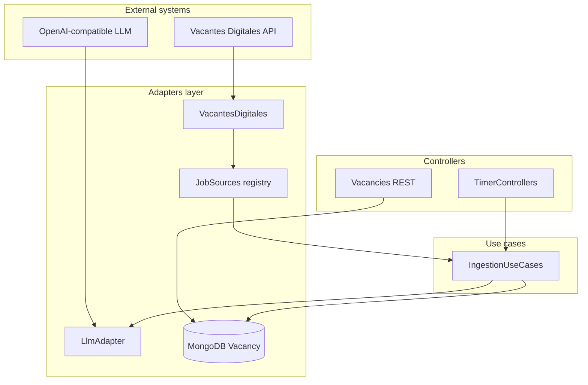

# Job hunting extensions ([PR #1](https://github.com/danielhumgon/job-hunting-api/pull/1))

This document summarizes what changed on branch `trout-custom` relative to unchanged boilerplate `master`, why those changes exist, how the new behavior works, and how the pieces fit together architecturally.

For low-level API shapes, metrics, and Vacantes Digitales field mapping, see [`specs.md`](./specs.md) at the repository root.

---

## 1. Scope of changes (file-level)

Compared to `master`, `trout-custom` adds or modifies roughly these areas:

| Area               | What changed                                                                                                                                                                                                                                                                                  |
| -------------------- | ----------------------------------------------------------------------------------------------------------------------------------------------------------------------------------------------------------------------------------------------------------------------------------------------- |
| **Specifications** | New`specs.md` — product and technical contract for ingestion, LLM scoring, REST, and timers.                                                                                                                                                                                                 |
| **Configuration**  | `config/env/common.js` loads `.env` via `dotenv`, and defines ingestion and LLM-related settings (interval, model URL, retries, minimum score, etc.). `.env-example` documents common variables.                                                                                              |
| **Dependencies**   | `dotenv`, `zod`; stricter `c8` thresholds in `npm run test:unit` (lines/statements 100%, functions 99%, branches 95%).                                                                                                                                                                        |
| **Adapters**       | `JobSources` registry + `VacantesDigitales` HTTP client; `LlmAdapter` + `fetch-with-retry.js` + `vacancy-scoring-prompt.md`; `Vacancy` Mongoose model and `LocalDB` query helpers; `Adapters.start()` warms job sources. Minor `IpfsAdapter` constructor injects `CreateHeliaNode` for tests. |
| **Use cases**      | `IngestionUseCases.ingestVacancies()` — orchestrates fetch → validate → score → upsert.                                                                                                                                                                                                   |
| **Domain**         | `entities/vacancy.js` — minimal validation before persistence.                                                                                                                                                                                                                               |
| **HTTP**           | `GET /vacancies/:page`, `GET/PUT/DELETE /vacancies/:id` (attached when Mongo is enabled).                                                                                                                                                                                                     |
| **Timers**         | `TimerControllers` runs scheduled vacancy ingestion in addition to existing usage cleanup/backup timers.                                                                                                                                                                                      |
| **Tests**          | Unit coverage for job sources, LLM adapter, retry helper, localdb vacancy listing, ingestion use case, vacancies REST layer, timer ingestion path, config, and updated mocks.                                                                                                                 |
| **Docs / misc**    | Root`README.md` no longer links to `dev-docs` (content-only tweak).                                                                                                                                                                                                                           |

---

## 2. Why it was changed

The boilerplate is a generic IPFS / BCH wallet service with users, usage stats, and Mongo. The fork layers on a **repeatable job-ingestion pipeline**:

1. Pull normalized job rows from external sources (initially [Vacantes Digitales](https://vacantesdigitales.com/api#endpoints)).
2. **Score** each vacancy with an LLM so search and filtering can rank by fit and store human-readable reasons/flags.
3. **Persist** idempotently keyed by `(source, externalId)` so re-runs update the same logical job.
4. **Expose** vacancies over REST for clients or internal tools.
5. **Schedule** ingestion on an interval (and optionally once at boot) without blocking the rest of the server.

The design follows the existing **Clean Architecture** style in the repo: adapters talk to the outside world; use cases orchestrate; controllers (REST and timers) only wire dependencies and invoke use cases.

---

## 3. How it works (data flow)

### 3.1 Ingestion pipeline (use case)

`IngestionUseCases.ingestVacancies()` (`src/use-cases/ingestion.js`):

1. **Fetch** — `adapters.jobSources.ingestVacancies()` merges results from every registered source that implements `fetchVacancies()`. Per-source errors are logged; successful batches are concatenated. Metrics describe duration and per-source counts.
2. **Dedupe** — In-memory dedupe by `(source, externalId)` so duplicates from overlapping fetches collapse to one row.
3. **Validate** — `VacancyEntity.validateForPersistence()` ensures `source`, `externalId`, and `title`. Invalid rows are skipped (counted in metrics).
4. **Score** — `adapters.llm.score(row)` calls an OpenAI-compatible `POST …/chat/completions` endpoint. Failures return `llmStatus: 'failed'` but the row is still persisted when possible so data is not dropped solely because the model was down.
5. **Persist** — `VacancyModel.updateOne({ source, externalId }, { $set: doc }, { upsert: true })` merges source fields with LLM fields.

Returned value: `{ ok, metrics }` with timings and counters (fetched, deduped, skipped, LLM failures, upsert stats).

### 3.2 Vacantes Digitales adapter

`VacantesDigitales` (`src/adapters/job-sources/vacantesdigitales.js`):

- **`start(targetCount)`** — Optional bootstrap: loads categories and paginated `GET /api/list` for a quick snapshot (used when `JobSources.start()` runs during `Adapters.start()`).
- **`fetchVacancies()`** — Ingestion path: pages `GET /api/vacancies` with filters (e.g. category `desarrollo`, `location_type=remoto`, configurable `limit`), maps each API row through **`normalize()`** into the canonical document shape (URLs, dates, skills, `ingestionVersion`, and LLM placeholders such as `llmStatus: 'pending'`).

New sources can be added by implementing the same contract and registering the class in `JobSources.sources` (`src/adapters/job-sources/index.js`).

### 3.3 LLM adapter

`LlmAdapter` (`src/adapters/llm/index.js`):

- Reads the system prompt from `vacancy-scoring-prompt.md` (evaluates postings for a developer audience; insists on JSON `{ score, reasons, flags }`).
- Sends a truncated user JSON payload (title, company, keywords, summary, content cap, etc.).
- Parses assistant output (JSON extracted from text if needed), validates with **Zod**, clamps `score` to `[0, 1]`, normalizes reasons/flags to deduped lowercase strings.
- Computes **`belowMinScore`** when `MIN_VACANCY_LLM_SCORE` is set in config.
- Uses **`fetchPostWithRetry`** for transient HTTP failures (429, 5xx, etc.) with exponential backoff and jitter.

### 3.4 Persistence and read API

- **Model** — `src/adapters/localdb/models/vacancy.js` defines indexes: unique `(source, externalId)`, filters on category/location/`llmScore`, text index on title/summary/keywords.
- **Queries** — Vacancy list/read/update/delete are implemented in `VacancyLib` (`src/use-cases/vacancy.js`): paginated list via `GET /vacancies/:page` (fixed page size), single document by id, update, and delete.
- **REST** — Routes are mounted under `/vacancies` (same Koa router pattern as other REST modules in the project).

### 3.5 Timers

`TimerControllers` (`src/controllers/timer-controllers.js`) keeps the boilerplate **cleanUsage** and **backupUsage** intervals and adds **`ingestVacancies`**:

- Interval from `ingestIntervalMs` (constructor override, else `config.ingestIntervalMs`, default three hours).
- If `ingestOnBoot` is true and `env !== 'test'`, runs one ingestion immediately when timers start.
- Each tick clears and resets the interval (same pattern as other timers) and logs returned metrics.

---

## 4. High-level architecture

- **Timers** and **REST** sit at the edges; they depend on **use cases** and **adapters**, not on each other.
- **Ingestion** is the only place that sequences “fetch → LLM → write”; REST reads Materialized vacancy documents only.
- **Configuration** centralizes ingestion/LLM behavior so environments can swap models, URLs, and intervals without code changes.

---

## 5. Configuration reference (conceptual)

| Concern                                | Typical source                                          |
| ---------------------------------------- | --------------------------------------------------------- |
| Ingest on boot                         | `INGEST_ON_BOOT=true` → `config.ingestOnBoot`          |
| Interval                               | `INGEST_INTERVAL_MS` → `config.ingestIntervalMs`       |
| Ingestion schema version stamp on docs | `JOB_INGESTION_VERSION` → `config.jobIngestionVersion` |
| LLM base URL                           | `LLM_API_URL` (must include `/v1` where required)       |
| Model / auth                           | `LLM_MODEL`, `LLM_API_KEY` or `OLLAMA_API_KEY`          |
| Retry budget                           | `LLM_MAX_RETRIES` (additional tuning in common.js)      |
| Minimum score flag                     | `MIN_VACANCY_LLM_SCORE`                                 |

---

## 6. Operational notes

- **Resilience**: One bad vacancy or one failed LLM call does not abort the whole tick; metrics record failures for observability.
- **Tests**: Mocking `CreateHeliaNode` on `IpfsAdapter` isolates Helia/IPFS from unit tests; coverage gates were tightened to protect the new surface area.
- **Mongo disabled**: Vacancies REST is only attached when `noMongo` is false (consistent with auth/user routes). Ingestion still expects a usable `Vacancy` model when the timer runs — operators should enable Mongo for full job-hunter behavior.
